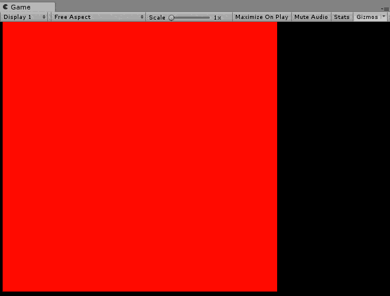

# DirectCompute-Graphics-Sample-FluidCS11-Unity
this is just a copy of https://code.msdn.microsoft.com/windowsdesktop/DirectCompute-Graphics-425de5a8

64k particles simulate with sorted grid

## Related

- https://github.com/kodai100/Unity_PositionBasedFluid
- https://github.com/obushi/SPHFluid
- http://www.slis.tsukuba.ac.jp/~fujisawa.makoto.fu/cgi-bin/wiki/index.php?%CE%B3%BB%D2%CB%A1